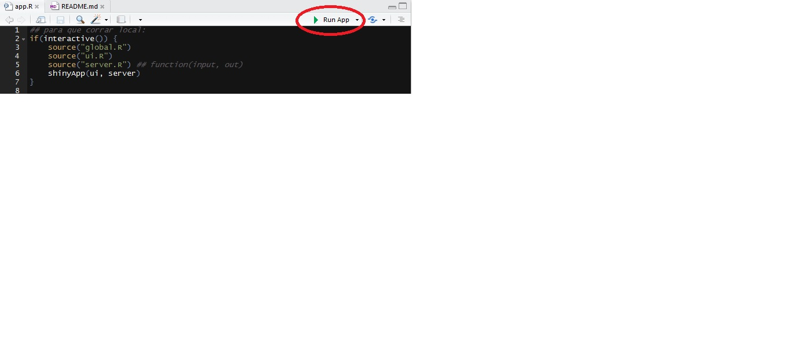

## Descripción

Esta aplicación fue desarrollada por los alumnos de la **Maestría en Estadística Aplicada** de la [Universidad Nacional de Rosario](http://www.fcecon.unr.edu.ar/web-nueva/estadistica-1) cohorte 2016: [Ing. German Beltzer](https://www.linkedin.com/in/germanbeltzer), [Dr. Manuel Mancilla](https://ar.linkedin.com/in/manuel-mancilla-764a9bb3) e [Ing. Santiago Silvestrini](https://www.linkedin.com/in/ssilvestrini) como proyecto final de la cátedra **Inferencia Estadística** a cargo de las docentes: _Mgs. Fernanda Méndez_ y _Dra. Marta Beatriz Quaglino_ en el mes de Abril de 2017.

La intención es abordar de manera interactiva y educacional la temática de **Test Permutacionales**. Nos basamos principalmente en el paper [Permutation tests for univariate or multivariate analysis of variance and regression](http://www.nrcresearchpress.com/doi/abs/10.1139/f01-004) publicado por la Canadian Journal of Fisheries and Aquatic Sciences, 2001, 58(3).

## Instalación:

El código fuente se encuentra disponible en un repositorio de Github para que sea accedido por libremente por cualquier persona que lo desee aquí: [Código Fuente](https://github.com/santiagosilvestrini/PermutationTestApp"). También alentamos a quien lo utilice a realizar mejoras y sugerencias. Para reporte de errores, por favor dirigirse aquí: [Reporte de Errores](https://github.com/santiagosilvestrini/PermutationTestApp/issues).

Una vez descargado el código fuente, se encontrá con la siguiente estructura: 

* app.R: 
* body.R
* global.R
* header.R
* PermutationTests.Rproj
* README.md
* server.R
* sidebar.R
* ui.R
* /anova
    + anova.Rmd
    + consumo_hormigas.txt
    + server.R
    + ui.R
* /conclu
    + conclusiones.Rmd
    + server.R
    + ui.R
* /helpers
    + custom_functions.R
    + helpers.R
* /intro
    + server.R
    + ui.R
* /refe
    + server.R
    + ui.R
* /regresion
    + linearRegrPerm.Rmd
    + server.R
    + ui.R
    + unmployment.csv
* /simulador
    + server.R
    + ui.R
* /www
    
Para ejecutar la aplicación abra el archivo de proyecto **PermutationTests.Rproj**  desde el _R Studio_ y ubique el archivo de inicio de la aplicación: **app.R**. Una vez abierto este archivo notará un ícono verde en la parte superior derecha del editor acompañado de la leyenda: **Run App* tal como muestra la siguiente figura:


Para ejecutar la aplicación haga click sobre dicho ícono.

**Nota 1:** Para una mejor experiencia recomendamos ejecutar la aplicación en su navegador favorito, en lugar de utilizar el Viewer propio de R Studio. Para ello, seleccione la opción **Run External** del desplegable que se encuentra justo al lado de la leyenda, como se puede ver en la siguiente imagen:


**Nota 2:** La primera vez que se ejecute la aplicación se instalarán más de ~15 paquetes de R. Recomendamos instalarlos antes de correr la aplicación para una mejor experiencia, ejecutando las siguientes líneas en su consola de R:

```
if (!require("pacman")) install.packages("pacman") # Administrador de Paquetes
pacman::p_load("shiny","shinydashboard", "RColorBrewer", "markdown", "combinat",
               "shinyjs", "HistData", "mcsm", "ggplot2", "plotly", "shinyBS",
               "knitr", "lmPerm", "coin", "perm" )
```
De no hacerlo la aplicación correrá de todas formas e intentará instalar todos los paquetes a través del código en el archivo **global.R**.
Para obtener una descripción de esos paquetes y enlaces a su documentación, por favor visite la sección de referencias.

## Referencias

### Bibliografía:
* [Permutation tests for univariate or multivariate analysis of variance and regression](http://www.nrcresearchpress.com/doi/abs/10.1139/f01-004) Canadian Journal of Fisheries and Aquatic Sciences, 2001, 58(3)
* [Randomization, Bootstrap and Monte Carlo Methods in Biology, Third Edition](https://www.amazon.es/Randomization-Bootstrap-Methods-Biology-Statistical/dp/1584885416)
* [The diet of the eastern short-horned lizard (Phrynosoma douglassi brevirostre) in Alberta and its relationship to sexual size dimorphism](http://www.nrcresearchpress.com/doi/abs/10.1139/z84-066)

### Material Extra:
* Video: [An Introduction to the Permutation Test](https://www.youtube.com/watch?v=GmvpsJHGCxQ) por Lloyd Rieber
* [Permutation Tests](https://en.wikipedia.org/wiki/Resampling_(statistics)#Permutation_tests) (Wikipedia)
* [Lecture 40 - 13 04 Permutation Test](https://es.coursera.org/learn/statistical-inference/lecture/Nmd6U/13-04-permutation-tests) parte del [Statistical Inference Course](https://es.coursera.org/learn/statistical-inference) de la Johns Hopkins University en Coursera.
* Blog Jared Wilber (UC Berkeley) [Permutation Test: Explanation and Implementation in R](https://jwilber.github.io/2017/01/12/Permutation-Test-Explanation-And-Implementation-In-R.html)
* [Statistical Abstract of the United States](http://college.cengage.com/mathematics/brase/understandable_statistics/7e/students/datasets/slr/frames/frame.html)

### Paquetes R y Herramientas utilizadas:
* [shiny](https://cran.r-project.org/web/packages/shiny/index.html): Web Application Framework for R
* [shinydashboard](https://cran.r-project.org/web/packages/shinydashboard/index.html): This package provides a theme on top of 'Shiny', making it easy to create attractive dashboards.
* [markdown](https://cran.r-project.org/web/packages/markdown/index.html): 'Markdown' Rendering for R
* [combinat](https://cran.r-project.org/web/packages/combinat/index.html): combinatorics utilities
* [shinyjs](https://cran.r-project.org/web/packages/shinyjs/vignettes/shinyjs.html): Easily improve the user interaction and user experience in your Shiny apps in seconds.
* [HistData](https://cran.r-project.org/web/packages/HistData/index.html): Data Sets from the History of Statistics and Data Visualization.
* [mcsm](https://cran.r-project.org/web/packages/mcsm/index.html): Functions for Monte Carlo Methods with R.
* [ggplot2](https://cran.r-project.org/web/packages/ggplot2/index.html): Create Elegant Data Visualisations Using the Grammar of Graphics.
* [plotly](https://cran.r-project.org/web/packages/plotly/plotly.pdf): Easily translate 'ggplot2' graphs to an interactive web-based version and/or create custom web-based visualizations directly from R.
* [shinyBS](https://cran.r-project.org/web/packages/shinyBS/index.html): Twitter Bootstrap Components for Shiny.
* [knitr](https://cran.r-project.org/web/packages/knitr/index.html):  A General-Purpose Package for Dynamic Report Generation in R.
* [lmPerm](https://cran.r-project.org/web/packages/lmPerm/index.html): Permutation Tests for Linear Models.
* [coin](https://cran.r-project.org/web/packages/coin/index.html): Conditional Inference Procedures in a Permutation Test Framework.
* [perm](https://cran.r-project.org/web/packages/perm/index.html): Exact or Asymptotic permutation tests.
* [Online LaTeX Equation Editor](https://www.codecogs.com/latex/eqneditor.php): Herramienta online para generar expresiones LaTeX.
* [Font Awesome Icons Collection](http://fontawesome.io/icons/): Todos los íconos de la aplicación son de esta colección.
